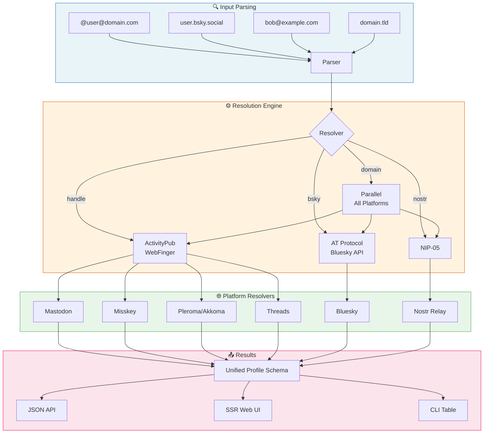

<div align="center">

# `search-fedi-profile`

**Discover any Fediverse profile across all protocols**

[](https://www.typescriptlang.org/)
[](https://hono.dev)
[](https://pnpm.io)

A unified search tool that queries **Mastodon**, **Bluesky**, **Nostr**, **Threads**, **Misskey**, and **Pleroma** in parallel.  
Enter any fediverse address — we find it wherever it lives.

[Quick Start](#quick-start) · [CLI Usage](#cli) · [API](#api) · [Architecture](#architecture) · [Platforms](#supported-platforms)

</div>

---

## Quick Start

```bash
# Clone and install
git clone https://github.com/your-org/search-fedi-profile.git
cd search-fedi-profile
pnpm install

# Run the web server
pnpm start
# → http://localhost:3000

# Or use the CLI directly
pnpm cli @gargron@mastodon.social
```

## How It Works

```
┌─────────────────────────────────────────────────────────────┐
│                      User Input                             │
│  "@user@domain"  │  "user.bsky.social"  │  "bob@site.com"   │
└────────────────────────────┬────────────────────────────────┘
                             │
                             ▼
                  ┌─────────────────────┐
                  │   Auto-Detect       │
                  │   Input Parser      │
                  └─────────┬───────────┘
                            │
           ┌────────────────┼────────────────┐
           │                │                │
           ▼                ▼                ▼
     ┌────────────┐   ┌───────────┐   ┌───────────┐
     │ ActivityPub│   │ AT Proto  │   │  NIP-05   │
     │ WebFinger  │   │  (Bluesky)│   │  (Nostr)  │
     └─────┬──────┘   └─────┬─────┘   └─────┬─────┘
           │                │               │
           ▼                ▼               ▼
     ┌───────────┐   ┌───────────┐   ┌───────────┐
     │ Mastodon  │   │   API     │   │  .well-   │
     │ Misskey   │   │  Lookup   │   │  known +  │
     │ Pleroma   │   │           │   │  Relay    │
     │ Threads   │   │           │   │           │
     └─────┬─────┘   └─────┬─────┘   └─────┬─────┘
           │               │               │
           └───────────────┼───────────────┘
                           │
                           ▼
                  ┌─────────────────────┐
                  │  Unified Profile    │
                  │  Results (JSON/HTML)│
                  └─────────────────────┘
```

## Architecture



## CLI

```bash
# Basic usage
pnpm cli @gargron@mastodon.social
pnpm cli bsky.app
pnpm cli bob@example.com

# JSON output (for scripting)
pnpm cli --json @gargron@mastodon.social

# Pipe to jq
pnpm cli --json bsky.app | jq '.profiles[0].bio'
```

**Auto-detected input formats:**

| Pattern | Detected As | Example |
|---------|-------------|---------|
| `@user@domain` | ActivityPub handle | `@gargron@mastodon.social` |
| `user.bsky.social` | Bluesky handle | `alice.bsky.social` |
| `npub1...` | Nostr public key | `npub1abc...` |
| `name@domain` | Handle or NIP-05 | `bob@example.com` |
| `domain.tld` | Domain probe | `bsky.app` |

**CLI output example:**

```
───────────┼────────────────────────────────┼──────────────────────┼────────────┼─────────
Platform   │ Handle                         │ Name                 │  Followers │    Posts
───────────┼────────────────────────────────┼──────────────────────┼────────────┼─────────
bluesky    │ bsky.app                       │ Bluesky              │      33.8M │      781
mastodon   │ @Gargron@mastodon.social       │ Eugen Rochko         │      135K │   12,450
───────────┼────────────────────────────────┼──────────────────────┼────────────┼─────────
```

## API

**JSON API** at `/api/search`:

```bash
curl 'https://fedi.comefindme.dev/api/search?q=@gargron@mastodon.social'
```

**Response:**

```json
{
  "query": "@gargron@mastodon.social",
  "profiles": [
    {
      "platform": "mastodon",
      "handle": "@Gargron@mastodon.social",
      "displayName": "Eugen Rochko",
      "bio": "Founder of Mastodon...",
      "avatar": "https://files.mastodon.social/...",
      "url": "https://mastodon.social/@Gargron",
      "followersCount": 135201,
      "postsCount": 12450,
      "software": "mastodon"
    }
  ],
  "errors": []
}
```

**SSR Web UI** at `/search?q=...` renders Bulma-styled profile cards with avatars, bios, and stats.

## Supported Platforms

| Platform | Protocol | Discovery Method |
|----------|----------|-----------------|
| **Mastodon** | ActivityPub | WebFinger → Actor JSON |
| **Misskey** | ActivityPub | NodeInfo detect → WebFinger → Actor |
| **Pleroma / Akkoma** | ActivityPub | NodeInfo detect → WebFinger → Actor |
| **Threads** | ActivityPub | WebFinger on `threads.net` → Actor |
| **Bluesky** | AT Protocol | `public.api.bsky.app` XRPC API |
| **Nostr** | NIP-05 | `.well-known/nostr.json` → Relay kind:0 |

## Unified Profile Schema

```typescript
interface UnifiedProfile {
  platform: "mastodon" | "bluesky" | "nostr" | "threads" | "misskey" | "pleroma";
  handle: string;           // canonical handle
  displayName?: string;
  bio?: string;
  avatar?: string;
  banner?: string;
  url?: string;             // link to original profile
  followersCount?: number;
  followingCount?: number;
  postsCount?: number;
  createdAt?: string;
  software?: string;        // detected software name
  extra?: Record<string, unknown>;
}
```

## Configuration

| Variable | Default | Description |
|----------|---------|-------------|
| `PORT` | `3000` | Server port (or `--port` flag) |

## Development

```bash
pnpm dev          # Start with file watching
pnpm typecheck    # Run TypeScript checks
pnpm start        # Production server
```

## Project Structure

```
src/
├── core/
│   ├── types.ts              # UnifiedProfile, SearchResult types
│   ├── parsers.ts            # Input auto-detection
│   ├── detect.ts             # NodeInfo probe, software ID
│   ├── resolver.ts           # Orchestrator: parallel resolution
│   └── platforms/
│       ├── mastodon.ts       # WebFinger + ActivityPub
│       ├── bluesky.ts        # AT Protocol XRPC
│       ├── nostr.ts          # NIP-05 + WebSocket relay
│       ├── threads.ts        # WebFinger (threads.net)
│       ├── misskey.ts        # NodeInfo + ActivityPub
│       └── pleroma.ts        # NodeInfo + ActivityPub
├── server/
│   ├── index.ts              # Hono app entry
│   └── routes/
│       ├── api.ts            # GET /api/search?q=...
│       └── web.tsx           # SSR views (Bulma)
└── cli/
    └── index.ts              # CLI with colored table + --json
```

## License

MIT
